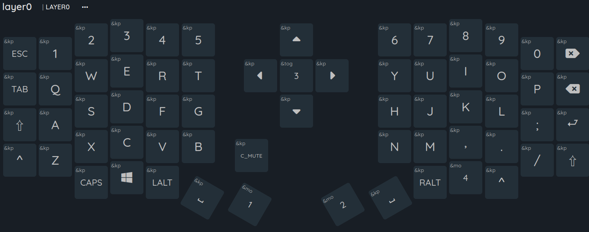
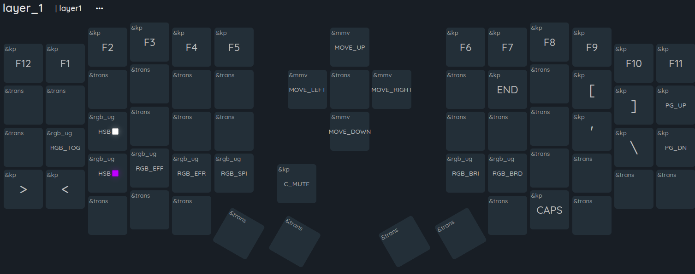
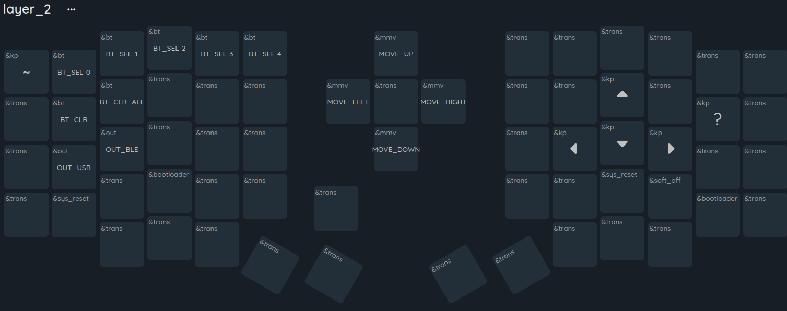
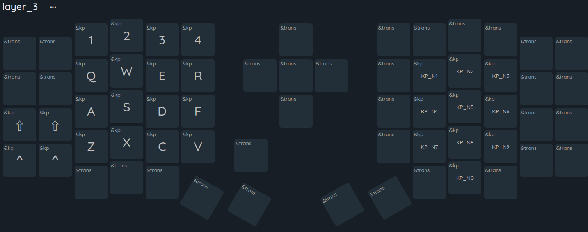
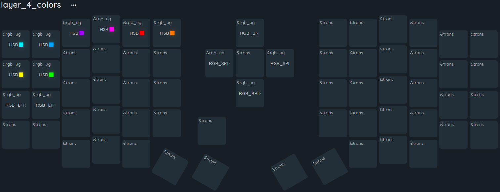

 [Web to modify keymap](https://nickcoutsos.github.io/keymap-editor/)
>[!Warning]
>the web include the line :
> `#include <dt-bindings/zmk/pointing.h>`
> if not compile remove this line
> 
- select sofle or github [source](https://github.com/a741725193/zmk-sofle)
- click on set keymap 
- add layer 
- customize

--- 
## My config

